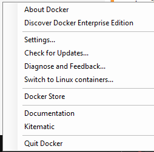
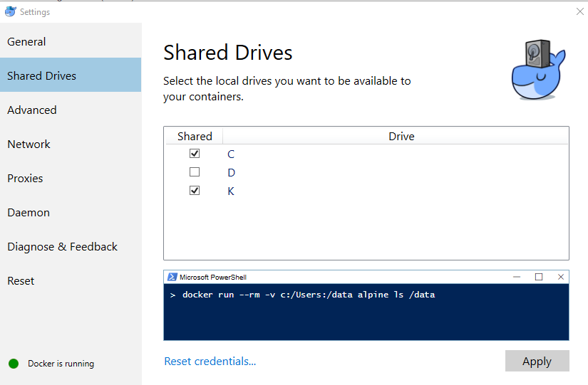

---
title: My first Blog post
abstract: Creating Dockerfile, Docker Image and Docker Container for Asp .Net Core Website.
keywords: ''
weblogName: MyWebsite
postId: 1
---
# My first Blog post

## Using Docker

When first trying to setup a container using Docker I found it very confusing due to the amount of different ways you can do one simple thing. This post aims to make it as simple as possible to understand and create Docker Containers starting from getting your environment setup. 

During the following tutorial I will be using a Windows 10 machine and [.Net Core](https://www.microsoft.com/net/core).

## Installing Docker

Since we will be using a Windows machine you will first need to install Docker for Windows. You can find the installation file [here](https://store.docker.com/editions/community/docker-ce-desktop-windows). After clicking the Get Docker button it will download the installation file to your machine.

Once installed you will need to right click the Docker Icon on your task bar notification area in the bottom right.


Click Switch to Linux containers...



Right click the Docker Icon again and click Settings...

In Docker Settings go to Shared Drives and check the drives you will be using for your projects. Then click Apply.



#### Docker is now installed and ready to use.


## Creating ASP.NET Core Project

To get started with Docker will first need to create a project to work with by running the following commands in CMD or PowerShell.

```
mkdir HelloDocker
cd HelloDocker
dotnet new web
```


These commands create a new Directory for your Project, moves to the newly created directory and then creates the Project.

The Project is a simple Website that returns "Hello World!" when the URL is hit.

## Creating a Dockerfile

Now to run the Website up in Docker we will first need to create a Dockerfile. A Dockerfile is the base of the custom Docker Image and container we will eventually create. 

To get started we will need to create an empty file in the same Directory as your project called Dockerfile, with no extension.

Then copy or type the following to the newly created Dockerfile.


```
FROM microsoft/aspnetcore-build:latest
COPY . /app
WORKDIR /app
 
RUN ["dotnet", "restore"]
RUN ["dotnet", "build"]

EXPOSE 5000/tcp
ENV ASPNETCORE_URLS http://*:5000

ENTRYPOINT ["dotnet", "run"]
```

* **FROM** - Retrieves the base image from Dockers Repository. The microsoft/aspnetcore-build:latest
image is pre-configured with all of the dependencies for running a ASP.NET Core website on Linux.

* **COPY** Copies the current working directories contents on your local machine to a new /app directory inside the image.
* **WORKDIR** Sets the images working directory
* **RUN** Executes a command inside the image. In this case we want to Restore all dependencies and Build the project.
* **EXPOSE** Exposes the port which you would like the image to have open.
* **ENV** Is used to set the Environment variables on the container image. ASPNETCORE_URLS environment variable is used to set what URL and Port the Project should listen on.
* **ENTRYPOINT** Specifies the command to execute when the container starts up.

## Creating a Docker Image

After the Dockerfile is created we can get started on creating the Docker Image.


```
docker build -t hello:docker .
```
**Don't forget the period!** This tells Docker that the Dockerfile is in the current directory.
The -t tag flag is for naming the image.

By running docker images, you can see the image that was just build and the base image that the Dockerfile is based FROM.

Once the image has been built we can run it and create a local container.

```
docker run --name helloworld -p 5000:5000 -t hello:docker 
```
The --name flag names the container, this makes it easier to run docker container commands and gives you a better idea as to what a container is doing if it has been named well.

The -p flag Exposes port 5000 on the Docker host and bridges it to port 5000 on the container. This makes it so if you go to http://localhost:5000 you will now see the response from the website.

To close the container you can press Crtl+C. You can also run the container in detached mode by using the -d flag when you run up the container, this makes it so you can close the command prompt or carry on typing commands.

To see what containers are currently running run

```
docker container ls
```
You can see the name of the container in the last column. 

To stop a detached container you can run

```
docker stop helloworld
```
You can also stop the container by using the Container ID, which shows in the first column of docker container ls command.


The next topic will be on how to use docker-compose to make it easier to deploy services to other Docker Hosts.